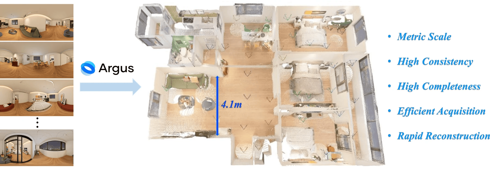
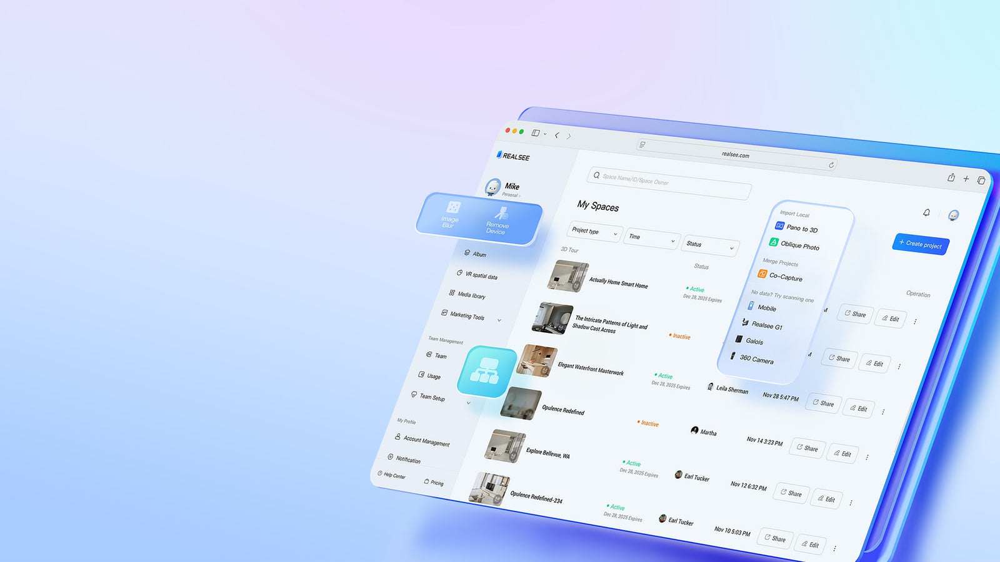

<p align="center">
  <a href="https://argus.realsee.ai/">
    
  </a>
</p>

# argus


[English](README.md) | [简体中文](README.zh-CN.md)

`argus` packages 1–99 local 2:1 panoramas into one normalized ZIP, submits a Realsee Argus task, and collects a validated `output.zip` containing EXR depth maps, one merged GLB point cloud, per-image poses, optional intrinsics, and `output.json`.

Version 2.0 keeps the Skill ID `argus` but does not include the old single-image VGGT fallback. Pin `v1.0.2` for square 1:1 input, the old single-GLB-only output, or legacy preview behavior. See the [migration guide](references/migration-v2.md).

[Argus](https://argus.realsee.ai/) · [Interactive demo](https://h5.realsee.ai/argus) · [Research](https://argus-paper.realsee.ai/) · [Realsee Developer Platform](https://developer.realsee.ai/)

The product and research pages show the wider Argus ecosystem. This Skill 2.0 exposes a deliberately narrower contract: **1–99 local RGB8 panoramas with exact 2:1 dimensions**. It does not accept arbitrary photos or expose every workflow shown on those sites.

<p align="center">
  <a href="https://argus-paper.realsee.ai/"></a>
  <a href="https://argus.realsee.ai/"></a>
</p>

## Install dependencies

From this package directory:

```bash
npm install
```

Node.js 22 or newer is required.

## Official example manifest

The Skill includes `examples/manifest.json`, which records the CDN URL, byte length, and SHA-256 digest for two first-party Realsee sample sets. The panorama JPEGs themselves are not bundled. Download a set to a new absolute directory outside the Skill:

```bash
node scripts/download-examples.mjs --region cn --output /absolute/example-output
```

Use `global` when it matches `REALSEE_REGION`. Only after all files pass the manifest checks does the downloader recheck the target and publish the complete directory with one atomic rename. A later Argus run still uploads the selected images to the corresponding Realsee Gateway and requires user consent. See [Official example panoramas](references/examples.md).

## Explicit lifecycle

Start from repeated images:

```bash
node scripts/run-argus.mjs start \
  --image /absolute/path/a.jpg \
  --image /absolute/path/b.png \
  --workspace /absolute/workspace-root \
  --yes --json
```

Or start from one existing ZIP:

```bash
node scripts/run-argus.mjs start \
  --zip /absolute/path/input.zip \
  --workspace /absolute/workspace-root \
  --yes --json
```

Capture the returned `workspace_dir`, then query once per invocation:

```bash
node scripts/run-argus.mjs status --workspace /absolute/workspace-root/<run-dir> --json
```

Collect after the remote task succeeds:

```bash
node scripts/run-argus.mjs collect --workspace /absolute/workspace-root/<run-dir> --json
```

There is no detached poller, `--async`, or `--resume`. `start`, `status`, and `collect` are independently resumable through schema-v2 `state.json`. A completed `collect` is idempotent.

## Input contract

- 1–99 JPEG, PNG, or WebP images.
- RGB, 8-bit, exact `width == 2 * height`.
- At least 2048×1024 is recommended; smaller images produce a warning.
- `--image` is repeatable and mutually exclusive with `--zip`.
- ZIPs may contain only images at the root. The Skill safely validates and deterministically repacks them.

The Skill rejects nested entries, path traversal, control characters, duplicate stems, and Unicode/case-fold name collisions before upload.

## Result contract

`task_status` describes the remote lifecycle: `queued`, `processing`, `succeeded`, or `failed`. `result_status` independently describes the algorithm output: `success`, `partial`, or `error`.

The collector validates and indexes this artifact matrix:

| Artifact | Contract |
| --- | --- |
| `output.zip` | Retained unchanged after a successful terminal download. |
| `output.json` | Required manifest; validated against the bundled JSON Schema and referenced files. |
| `depth/*_depth.exr` | One 32-bit floating-point, meter-scale depth map per successfully reconstructed image. |
| `pointcloud/merged.glb` | One merged, `right-handed, Y-up` point cloud for the successful image set. |
| `pose/*_pose.json` | One camera pose per successfully reconstructed image. |
| `intrinsics/*_intrinsics.json` | Optional and may be absent for some or all successful images. |
| `result.json` | Local index of artifact paths, statuses, warnings, and `missing_ids`. |

`partial` exits 0 but always carries an explicit warning and a non-empty missing-ID list. `error` exits non-zero.

## Configuration and safety

Configuration uses the existing environment contract:

- `REALSEE_APP_KEY`
- `REALSEE_APP_SECRET`
- `REALSEE_REGION` (`global` or `cn`)

Real runs upload the normalized input ZIP to Realsee remote services. Obtain user consent before upload. Credentials, upload tokens, provider errors, and signed result URLs must not be stored in workspace state or public logs.

The Arkclaw build is CN-only. Canonical, Claude plugin, Codex, and `npx skills` installs support both Gateway regions.

## Contracts

- [Gateway OpenAPI](references/argus-gateway-openapi.json)
- [Algorithm I/O](references/algorithm-io.md) / [中文](references/algorithm-io.zh-CN.md)
- [Official example panoramas](references/examples.md) / [中文](references/examples.zh-CN.md)
- [`output.json` JSON Schema](references/argus-output.schema.json)
- [Migration from 1.x](references/migration-v2.md) / [中文](references/migration-v2.zh-CN.md)
- [License](LICENSE)
